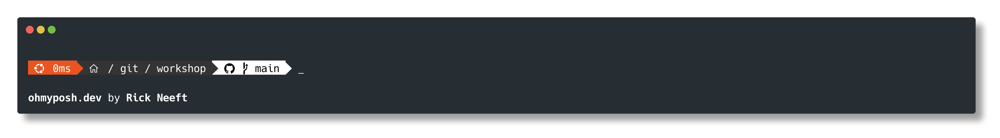

# My current oh-my-posh Theme


## config
```json
{
  "$schema": "https://raw.githubusercontent.com/JanDeDobbeleer/oh-my-posh/main/themes/schema.json",
  "blocks": [
    {
      "alignment": "left",
      "segments": [
        {
          "background": "transparent",
          "background_templates": [
            "{{ if contains \"ubuntu\" .OS }}#e95420{{ end }}",
            "{{ if contains \"windows\" .OS }}#004fe1{{ end }}"
          ],
          "foreground": "#ffffff",
          "style": "diamond",
          "template": " {{ .Icon }} ",
          "type": "os"
        },
        {
          "background": "transparent",
          "background_templates": [
            "{{ if contains \"ubuntu\" .OS }}#e95420{{ end }}",
            "{{ if contains \"windows\" .OS }}#004fe1{{ end }}"
          ],
          "foreground": "#ffffff",
          "properties": {
            "always_enabled": true
          },
          "style": "diamond",
          "template": "{{ .FormattedMs }} ",
          "type": "executiontime"
        },
        {
          "background": "#343434",
          "foreground": "#ffffff",
          "powerline_symbol": "\ue0b0",
          "properties": {
            "folder_icon": "\uf115",
            "folder_separator_icon": " / ",
            "home_icon": "\ueb06",
            "style": "full"
          },
          "style": "powerline",
          "template": " {{ .Path }} ",
          "type": "path"
        },
        {
          "background": "#ffffff",
          "foreground": "#000000",
          "powerline_symbol": "\ue0b0",
          "properties": {
            "branch_icon": " <#000000>\ue0a0 </>",
            "fetch_stash_count": true,
            "fetch_status": false,
            "fetch_upstream_icon": true
          },
          "style": "powerline",
          "template": " {{ .UpstreamIcon }}{{ .HEAD }}{{ if gt .StashCount 0 }} \ueb4b {{ .StashCount }}{{ end }} ",
          "type": "git"
        },
        {
          "background": "#ffff66",
          "foreground": "#111111",
          "powerline_symbol": "\ue0b0",
          "style": "powerline",
          "template": " \uf0ad ",
          "type": "root"
        }       
      ],
      "type": "prompt"
    }
  ],
  "final_space": true,
  "version": 3
}

``` 
